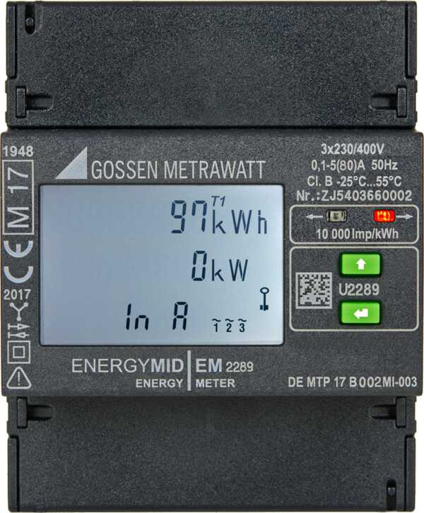

# Gossen-Metrawatt-ENERGYMID-EM22xx-Modbus
[](https://github.com/hasenradball/Gossen-Metrawatt-ENERGYMID-EM22xx-Modbus/actions/workflows/spell_checker.yml)

python solution for connecting the energy meter EM22xx via Modbus



## Contents
* [Prerecquisites](#prerecquisites)
* [Installation Steps](#installation-steps)
* [Library Installation](#library-installation)
* [Library Usage](#library-usage)
* [License](#license)
* [Helpful Links](#helpful-links)

## Prerecquisites
1. For this library you need python3
2. For the use of this python code it is necessary to install the python libs:
    - `pymodbus v3.9.2`
    - `pyserial`
> Remark: for `pymodbus` use the minimum version of 3.9.x, testetd with pymodbus==3.9.2

## Installation steps
### Make python ready to use
1. Create a python3 virtual environment in your home folder, see:<br>
[https://docs.python.org/3/library/venv.html](https://docs.python.org/3/library/venv.html)

```
python -m venv ~/my_python_venvs
```
2. Install the needed python packages

> the pymodbus documentation you will find here:<br>
[https://pymodbus.readthedocs.io/en/v3.9.2/](https://pymodbus.readthedocs.io/en/v3.9.2/)

```
~/my_python_venvs/bin/python -m pip install pymodbus==3.9.2
~/my_python_venvs/bin/python -m pip install pyserial
```
You can check the state by:

```
~/my_python_venvs/bin/python -m pip list
```

## Library Installation
Install the library from github.<br>
Lets assume you want to install it in the following path: `~/git_repos`
```
cd ~
mkdir git_repos
cd git_repos
git clone https://github.com/hasenradball/Gossen-Metrawatt-ENERGYMID-EM22xx-Modbus.git
```
## Usage
Check the python code in the script `em22xx_modbus.py` and change the settings if necessary.<br>
Especially the `ip-address` has to be adapted to your settings in the following line:
```
em2289_obj = EnergyMID_EM22xx("192.168.178.253")
```

### Check the Communication
After updated the ip you can check the communication.


```
cd /path/to/your/installation/folder

~/my_python_venvs/bin/python em22xx_modbus.py
```

The result could look like this example:

```
>>> Webserver is enabled!
Webserver status: 1


Voltages Primary: (416.2, 417.0, 417.5, 416.9, 240.4, 240.7, 240.9, 240.7) V
Currents Primary: (0.0, 0.0, 0.0, 0.0, 0.0) A
Power Primary   : (0, 0, 0, 0) W


Energy import total : 11600.56 kWh
Energy export total : 1.01 kWh
Device Features
[2, 0, 0, 1, 0, 0, 6, 0, 4, 0, 0]
        Type: U2289
        D   : Gossen Metrawatt
        H   : not available
        M   : with U, I, P, Q, S, PF, f, THD, In
        P   : with MID
        Q   : 1
        U   : 400 V
        V   : no impulse output
        W   : TCP/IP
        Z   : without Zählerstandsgang
        S   : 0

Firmware Version
        version :v1.21

INFO: test finished in 0.026 s
```

# License
This library is licensed under MIT Licence.

# Helpful Links
* [ESP8266-01-Adapter](https://esp8266-01-adapter.de)